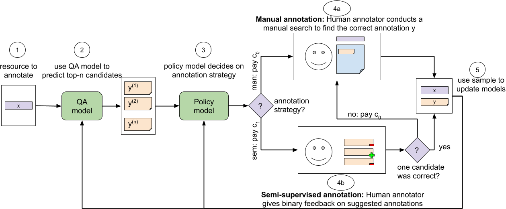

# Learning a Cost-Effective Annotation Policy for Question Answering
This is the PyTorch implementation of the EMNLP 2020 paper [Learning a Cost-Effective Annotation Policy for Question Answering](https://arxiv.org/abs/2010.03476).

Authors: [Bernhard Kratzwald](https://bernhard2202.github.io/), [Stefan Feuerriegel](https://mis.ethz.ch/about/feuerriegel.html), and [Huan Sun](http://web.cse.ohio-state.edu/~sun.397/)

<p align="center"></p>


State-of-the-art question answering (QA) relies upon large amounts of training data for which labeling is time consuming and thus expensive. For this reason, customizing QA systems is challenging. As a remedy, we propose a novel framework for annotating QA datasets that entails learning a cost-effective annotation policy and a semi-supervised annotation scheme. The latter reduces the human effort: it leverages the underlying QA system to suggest potential candidate annotations. Human annotators then simply provide binary feedback on these candidates. Our system is designed such that past annotations continuously improve the future performance and thus overall annotation cost. To the best of our knowledge, this is the first paper to address the problem of annotating questions with minimal annotation cost. We compare our framework against traditional manual annotations in an extensive set of experiments. We find that our approach can reduce up to 21.1% of the annotation cost.


## Source Code

You can find the source code used for the research paper [here](Code/README.md). Please understand that we lack time and resources to maintain this repository.

## Open Review

We want to support an open discourse about science and decided to publish our EMNLP 2020 [reviews](https://bernhard2202.github.io/reviews/emnlp2020.txt).


## Contact

Any questions left?

Please write an email to `bkratzwald [AET] ethz [DOT] ch`

## Citation

Please cite this paper if you use find our work useful

```BibTex
@inproceedings{Kratzwald.2020a,
  title={Learning a Cost-Effective Annotation Policy for Question Answering},
  author={Kratzwald, Bernhard and Feuerriegel, Stefan and Sun, Huan},
  booktitle={Conference on Empirical Methods in Natural Language Processing (EMNLP)},
  year={2020}
}
```